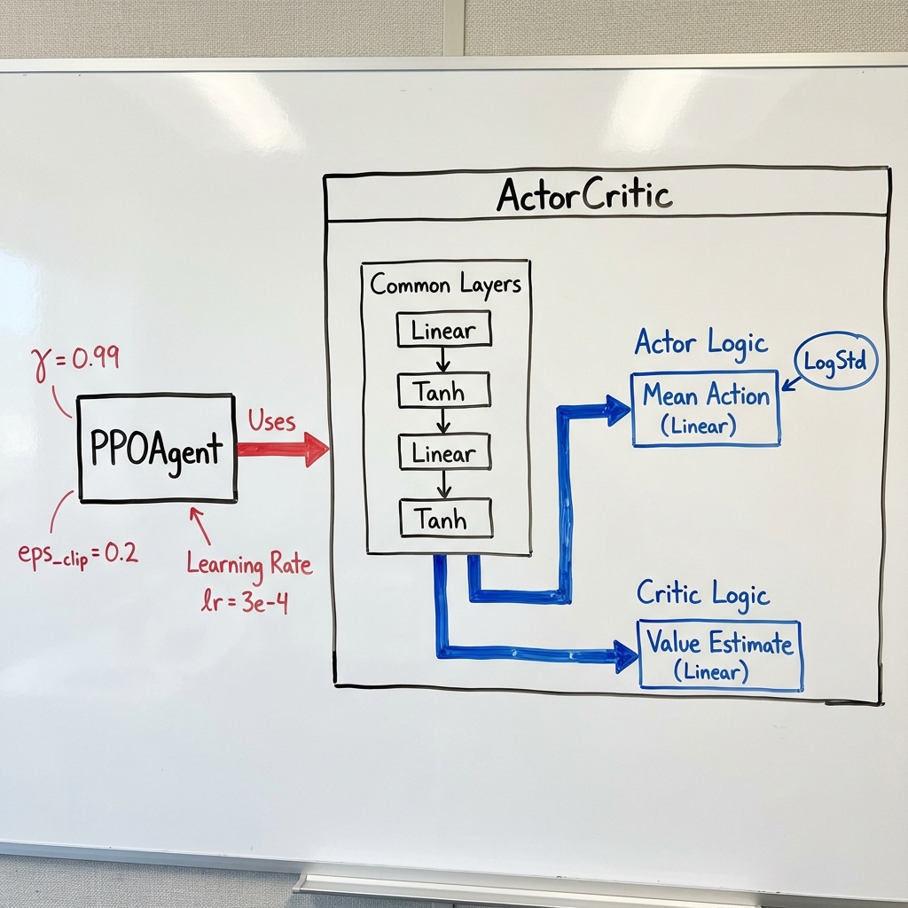
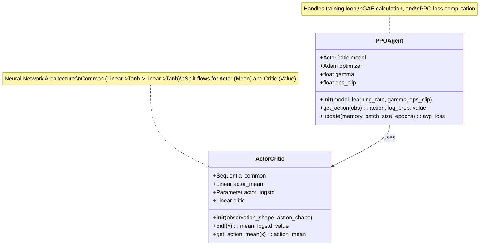

# Brain.py (MLX Implementation) Structure

This diagram follows the structure of `brain.py` but is visualized in a whiteboard style as requested.

## Mermaid Reference

## Flow Description

1. **Initialization**: `PPOAgent` is initialized with an instance of `ActorCritic`.
2. **Action Selection**: `PPOAgent.get_action(obs)` calls `ActorCritic` to get parameters, samples an action using normal distribution, and returns the action, log probability, and value estimate.
3. **Training (`update`)**:
    - Unpacks memory (observations, actions, rewards, etc.).
    - Computes Generalized Advantage Estimation (GAE) and Returns.
    - Runs a PPO update loop for a number of epochs.
    - Shuffles data and processes mini-batches.
    - Calculates PPO loss (Actor loss + Critic loss).
    - Updates `ActorCritic` weights using `optimizer`.
